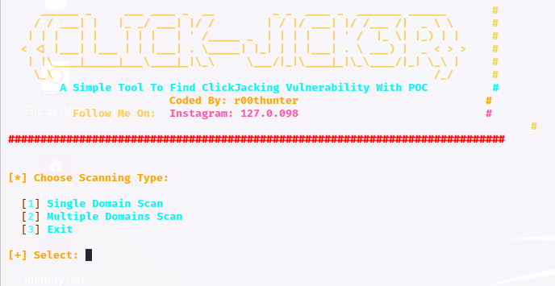

# clickjack

# Installation
    1. git clone https://https://github.com/machine1337/clickjack
    2. cd clickjack && chmod +x clickjack.sh
    
# Usage
    1. ./clickjack.sh
    
# Features
    1. Scan Single Target With POC Open In Browser If Vulnerable Otherwise Not.
    2. Scan Multiple Urls With One Click.
    3. 100% Easy To Use.
    4. More Features will Be Added IA.
    
# Note
    1. Make sure poc.html is placed in the same folder with clickjack.sh file.
    
#  Follow Me On:
  1. https://instagram.com/127.0.0.98 
 
